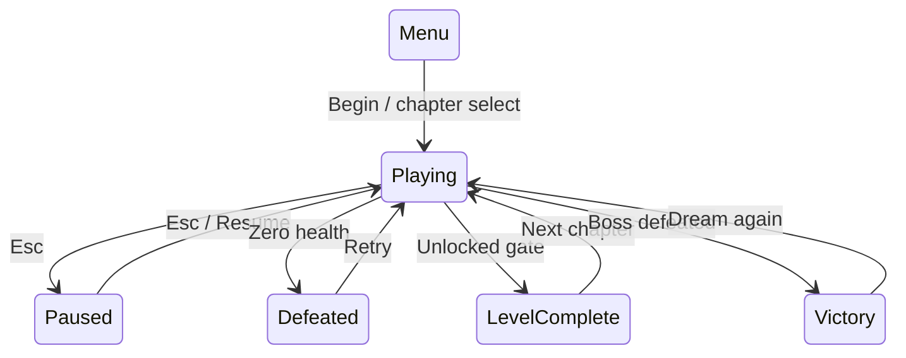
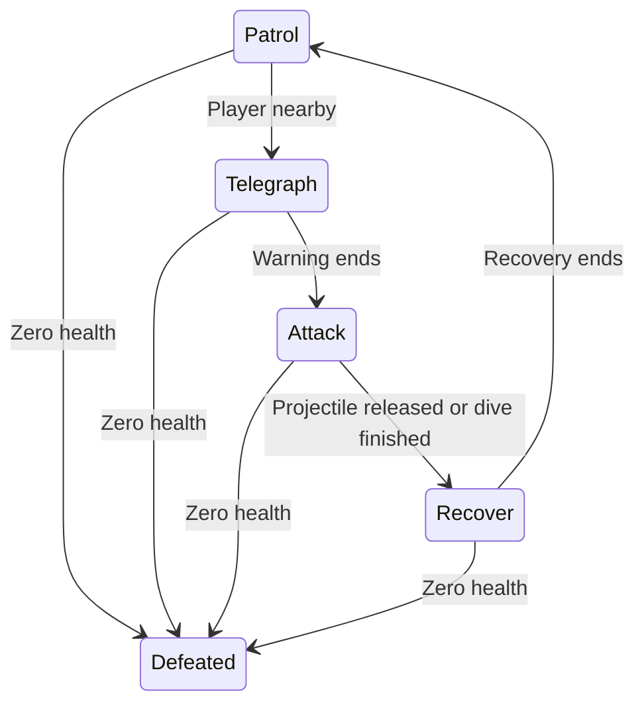
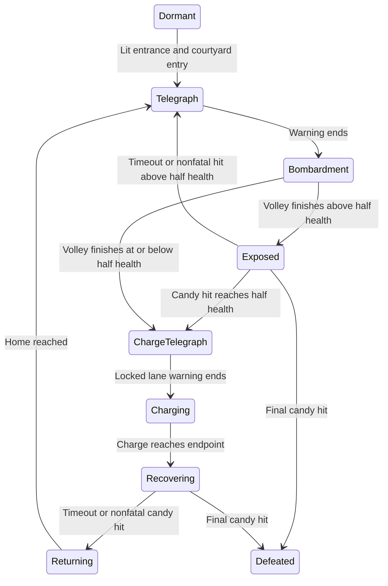

# Lanterns of the Lost Dream — Prototype design v0.9

## High concept

A dreamwalker crosses a Halloween dream disappearing into nightmare fog. Pumpkin lanterns restore missing roads. A bow clears flying nightmares; candy breaks the Pumpkin King's exposed shell. Win by restoring two dream chapters and defeating the boss inside his castle.

**Genre:** short single-player 3D action adventure with environmental switching and light puzzles. **View:** lower third-person perspective follow camera, inspired by the user's It Takes Two reference. **Prototype target:** keyboard/mouse on macOS. **Visual tone:** purple floating islands, warm pumpkin light, teal restored paths, pink/blue/gold candy and boss hues.

The user's established concept is three chapters, lanterns revealing roads or dispersing nightmares, bow combat against small flying dragons, and a castle pumpkin boss attacked with collected candy after dodging bombs. The precise rules, counts, controls, and timings below are implementation proposals for playtesting.

## Game script

### 1 — The First Light

The player appears on a floating island. The title screen explains controls. A gold practice rune introduces aiming and the bow. A pumpkin lantern near the northern edge reveals two wide round platforms with visible landing rims. A sign teaches Space to jump; directional input adjusts the airborne landing point. The second connection retains its lantern-restored bridge. The next island introduces a moving dragon and another lantern. The final island supplies wrapped candy and a pink seal: E picks up candy; right-click throws it. Until the pink seal is broken, refill the final island’s two candy spots every three seconds. Each spot holds at most one pickup; held candy, unlit lanterns, and candy elsewhere do not block replenishment. Pause freezes the timer. Clearing both lanterns, the dragon, and both seals opens the exit to chapter 2.

### 2 — Shattered Gardens

Follow a bending chain of islands. Three lanterns create successive crossings; five flying enemies patrol above the route: a basic ember dragon, a slow-orb ghost, an evolved dragon, a fan-shot bee and a diving demon. Their original encounter positions and health counts are retained. The first two crossings keep their bridges; the final crossing uses three smaller staggered round platforms, including a raised middle landing. Lanterns stay lit and save a safe checkpoint. Bow attacks are unlimited with a short cooldown. All species telegraph their attacks and then recover. Dragons use an aimed ember; Ghost uses a slow blue orb at 5 units/s; Armabee uses three gold projectiles at 7.5 units/s, spaced 18 degrees apart. Demon shows a locked ground lane for 1.3 seconds, dives toward the initial target at 10 units/s, deals at most one contact hit, then returns home without another contact attack. Sideways movement avoids the dive; dash immunity also applies. Keep moving or dash through danger. The exit requires all lanterns and dragons.

### 3 — The Pumpkin Keep

A lantern reveals two narrow raised round platforms across the castle approach, requiring two platform landings followed by a jump into the courtyard. Entering the courtyard wakes the Pumpkin King. He gives a warning, then sends falling pumpkin bombs; orange circles mark blast radii. Move out or dash while collecting glowing candy. In the first half, each volley opens his face for four seconds. Candy must match his current body hue. One accurate matching-color candy throw removes one of six health points and closes that window. Arrows and protected-phase candy do no damage.

The hit that reduces health to 3/6 immediately unlocks his first charge. A 1.6-second warning marks a broad ground lane aimed at the player's initial position; moving afterward does not redirect it. The head then charges at 15 units per second, dealing at most one health point per charge and respecting normal dash/post-hit immunity. Its stone dais remains fixed. The endpoint stays within the courtyard. Move sideways or use Shift; the ordinary jump cannot clear the head's height. Afterward, the boss stops and turns its face toward the player, opening the matching-color weak point for 2.4 seconds. A nonfatal candy hit or the window's end closes the shell and sends it home. Later cycles use four bombs with shorter fuses followed by another charge; bomb explosions finish before the charge warning. Defeat clears bombs and charge warnings and displays victory.

### Candy color matching

Start with PINK [O] as the sole required and supplied color. The first successful hit unlocks BLUE [<>] and makes it the next required hue; the second unlocks GOLD [*] and makes it next. All three hues have therefore been introduced before half-health charges. After introduction, required hues rotate between attack cycles. Above-half-health missed windows also rotate among currently unlocked hues; at full health, a missed window keeps pink. The hit that reaches half health begins a new charge cycle in the next hue. A nonfatal recovery hit chooses the next hue for the return/new attack, while an unanswered recovery changes hue only after returning home.

During a single bomb/charge sequence and its vulnerable window, the hue stays fixed. The head's ribs, candy bodies/rings, HUD required-color text, held-candy display and reticle show the hue. Text names and distinct symbols supplement the colors. Nearby floor labels are hidden behind solid scenery or the boss so they cannot suggest a different color over its face. Open-shell state is separately shown as SHELL OPEN or STUNNED; a matching color alone does not make a closed shell vulnerable. Wrong candy is consumed with no damage, gives mismatch feedback, and leaves the vulnerable window open. Arrows cannot damage the boss.

E at a different-colored pickup swaps it with the held candy, leaving the previous sweet on the floor. Same-color pickups are skipped while carrying candy, so nearby lamps and different colors remain interactable. Boss supplies refill on the four-second timer and on color/window boundaries. Safe floor points outside the head's current footprint provide at least two required-color sweets, with the remaining slots used for other unlocked hues. A full floor of wrong colors cannot block matching supply: floor colors are rebalanced when needed; held and in-flight candy never changes hue. The tutorial still supplies ordinary pink candy every three seconds until its seal clears.

## Rules and feedback

| System | Rule | Feedback |
| --- | --- | --- |
| Lantern | E nearby; permanent bridge activation; heal 1; save checkpoint | Flame, warm light, teal road, sound, counter, message |
| Bow | Unlimited arrows; 0.38 s cooldown; projectile collision; small aim assist | Arrow trail, shot sound, health indicator, hit burst |
| Candy | Carry one; E pickup/exchange; ballistic throw retains hue; consumed on throw | Held hue, names/symbols, floor labels and pickup/throw sounds |
| Flying nightmares | Five garden encounters, four behavioral species; patrol, warning, attack, recovery | Imported animated models, species names, warning hints, distinct projectiles and dive lane |
| Jump | Space: 2.2-unit grounded jump, gravity and head collision; no double jump or immunity | Takeoff, airborne leg tuck and landing compression |
| Round platforms | One lantern-activated jumping route per chapter; flat tops, empty gaps, increasing precision | Cyan landing rims, gold center dots, entry/exit rings and Space instructions |
| Dash | Shift: 0.22 s dash; 1.05 s cooldown; damage immunity during dash | Teal burst, sound, readiness indicator |
| Health | 5 points; 1.05 s post-hit immunity; retry at zero | Health segments, flashing character, hurt sound |
| Fall | Lose 1 health; return to checkpoint | Return and explanatory message |
| Boss supply | Random safe floor positions outside head footprint; target four pickups with two matching sweets | Colored floating wrappers and short nearby labels |
| Boss matching | Candy hue must match while shell is open; wrong color consumes candy without damage or closing the window | Body hue, separate open/closed state, required name/symbol and mismatch toast |
| Boss charge | Unlock at 3/6 health; 1.6 s locked-lane warning; one-point contact damage; 2.4 s exposed recovery, then return home | Marked corridor and arrow, warning sound, HUD phase instructions and exposed face |
| Exit | All chapter objectives required | Gate glow; explanatory rejection message |

The lantern is a spatial switch: activation changes where the player can physically travel. This version uses readable single-lantern/single-crossing relationships for bridges and round platforms; ordering puzzles can follow core-loop playtesting.

## State machines

Player movement combines locomotion, grounded jump, grounded dash, attack pose, post-hit immunity, carrying candy, and falling recovery. Chapter states control whether player actions are accepted. The player uses Mixamo's Timmy Humanoid rig with idle/run blending and masked aiming/throwing clips; movement stays with the CharacterController, and bow/candy follow animated hands. Candy carrying adds a procedural arm target. Bow aiming squares the chest with the shot direction, extends the left arm forward and keeps the right hand beside the face with a two-bone solve; arrows originate at the bow grip. Boss animation is procedural. Flying enemies use Quaternius's imported skeletons and flight, attack, and death clips; a separate orange charge ring preserves attack-warning readability.

## Next decisions

The prototype includes beginning-to-victory progression, sounds, checkpoints, retry, pause, mute, and chapter selection. There is no persistent save, controller support, or complex lantern ordering puzzle yet. Test camera scale, aiming, bridge width, bomb timing, and the readability of the vulnerability cue before expanding scope.
